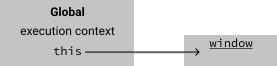

If you're a Java or C# programmer coming to JavaScript, forget all you know about `this`.
In JavaScript, the value of `this` is unfortunatly not very obvious, since it is determined by _how_ we choose to invoke a function.

`this` is actually a property of the _execution context_. So to understand what `this` is, we need to understand what an execution context is.

An execution context is a description of the environment the code is running in.
It has a pointer to the value of `this` and knows which functions and variables are in scope.

So our JavaScript code is always running in a specific execution context.
Before any code is executed, the JavaScript engine sets up a global execution context for us.

From the get-go, we have a place to look up the value of `this`, namely in the global execution context.
So what is `this` right off the bat? Try running the following program:

```js
console.log(this)
```

If we run it in a browser, we get something like:

```
Window {parent: global, postMessage: ƒ, blur: ƒ, focus: ƒ, close: ƒ, …}
```

This means that `this` refers to the window object, but when does it change?
As mentioned we get the value from the execution context, so the value of `this` of course changes when we enter a new execution context.

We enter a new execution context when we invoke a function. Lets start with a simple example:

```js
function giveName() {
  this.name = "Michael";
}

giveName();
console.log(this.window.name)
```

What's going on is:



Hello, world! This is a demo post for `gatsby-theme-blog`.

Delete me, and get writing!

```js:title=gatsby-config.js
module.exports = {
  plugins: [
    "gatsby-theme-blog", // highlight-line
    "gatsby-theme-notes",
  ],
}
```

This is another paragraph after the code block.

## This is a secondary heading

```jsx
import React from "react"
import { ThemeProvider } from "theme-ui"
import theme from "./theme"

export default props => (
  <ThemeProvider theme={theme}>{props.children}</ThemeProvider>
)
```
