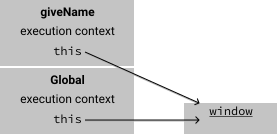
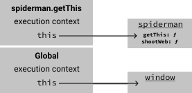
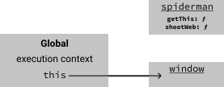
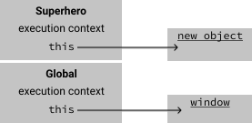
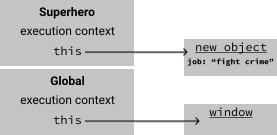
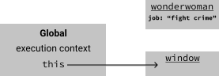

If you're a Java or C# programmer coming to JavaScript, forget all you know about _this_.
In JavaScript, the value of _this_ is unfortunatly not very obvious, since it's determined by _how_ we choose to invoke a function.

There's 4 ways to invoke a function and we'll go over each one:

1. As a function `myFunc()`
2. As a method `myObj.myFunc()`
3. As a constructor `const object = new myFunc()`
4. Via the functions apply or call methods `myFunc.call(myObj)`

So what is _this_? Finding out what _this_ is, is easy. We'll just log it:

```js
console.log(this)
```

Running the JavaScript in a browser, will give us something like:

```
Window {parent: global, postMessage: ƒ, blur: ƒ, focus: ƒ, close: ƒ, …}
```

We see that _this_ refers to the window object, but that's not always the case.

_this_ is actually a property of the _execution context_. Okay, so what the heck is an execution context?

An execution context is a description of the environment the code is running in.
Among other things, it has a pointer to the value of _this_ and knows which functions and variables are in scope.

Our JavaScript code always runs in an execution context.
Before any code is executed, the JavaScript engine sets up a _global execution context_ for us:


The value of _this_ can change when we enter a new execution context.
We enter a new execution context when we invoke a function. Lets start with a simple example:

### Calling a function _as a function_

```js
function giveName() {
  this.name = "Michael"
}

giveName()
console.log(window.name)
console.log(this.name)
console.log(name)
```

This output is:

```
Michael
Michael
Michael
```

Let's see what's going on in terms of the execution context.
When the code runs, the JavaScript engine has already set up an execution context for us. This is known as the global execution context (GEC).


A new execution context is created when we invoke `giveName`:



Inside `giveName`, we modify _this_ by setting a name property on it. We can see that _this_ references the `window` object.
When we're done executing `giveName`, we **pop** the giveName execution context and return to the global execution context.


It should be no surprise now that all the log statements print Michael.

### Calling a function _as a method_

In object-oriented programming languages you might think of a method as a function that belongs to a class.
In JavaScript however, a method is a function, that belongs to an object.

Let's see an example:

```js
const spiderman = {
  shootWeb: function() {
    console.log("🕸️")
  },
  getThis: function() {
    return this
  },
}

console.log(spiderman === spiderman.getThis())
```

The above program outputs true. The crucial part here is that getThis is a property on spiderman, so invoking it
results in _this_ being set to the object on the left side of the dot, i.e. spiderman.

The program starts out in the global execution context:


When we enter the execution context of the `spiderman.getThis()` call, we see that _this_ now points to the
target of the method invocation, namely the spiderman object:



We pop the `spiderman.getThis()` execution context when we return from the function.



The function `getThis` returns the value pointed to by _this_ while it was invoked. In our case _this_ pointed to spiderman and we
therefore see **true** in our output.

### Calling a function _as a constructor_

As you're about to see, there's nothing special about a constructor function.
The only noticeable difference is that it starts with a capital letter, but this is just a convention.
It's a good convention though, so stick to it! What's special is the way we invoke it, using the `new` keyword.

In the next example we use the `new` keyword to invoke the `Superhero` function as a constructor.
This has a few implications:

1. A new object is created
2. The value of _this_ is bound to the new object during execution of the function
3. The object created in step 1 is returned as a result of the whole _new_ expression, unless the function explicitly returns another object.

```js
function Superhero() {
  this.job = "fight crime"
}

const wonderwoman = new Superhero()
console.log(wonderwoman.job)
```

The program outputs: fight crime.

As with any other JavaScript program, we start in the global execution context:


When we enter the execution context of Superhero, by using the `new` operator, _this_ points to a newly created object:



We then assign a value to `this.job`, which sets the _job_ property on the new object:



Upon returning to the global execution context, we save the new object returned from the _new_-expression in a variable called wonderwoman.



### What if we forget new

It's easy to forget those three letters, n-e-w, and this frequently happens. Let's see what happens if we forget it.

```js
function Superhero() {
  this.job = "fight crime"
}

const wonderwoman = Superhero() // Oh no! Forgot to add new 🤦
console.log(wonderwoman.job)
```

We get an error:

```
Uncaught TypeError: Cannot read property 'job' of undefined
    at <anonymous>:6:25
```

Invoking Superhero no longer returns an object, because we're not invoking it _as a constructor_, but rather _as a function_.
So `Superhero()` returns _undefined_, hence the TypeError.

But what does _this_ point to? Recall that if we invoke a function _as a function_, _this_ points to _window_.
So we're actually setting a property on window, and if we were to log it, we would get the proof:

```js
console.log(window.job)
```

This outputs: fight crime. It is now the windows job to fight crime and wonderwoman is undefined, how will we ever survive? 😮
What's so bad about this is that it fails silently. We do not discover the issue until we try to access the job property on wonderwoman.

We can make this a great deal better by adding "use strict" to our program.

```js
"use strict"

function Superhero() {
  this.job = "fight crime"
}

const wonderwoman = Superhero() // Oh no! Forgot to add new 🤦
```

When in _strict mode_, invoking a function _as a function_ sets _this_ to undefined.
This is great because we don't accidentally add properties to the global object and we catch the error earlier.
The above program fails during the excution of Superhero.

```
Uncaught TypeError: Cannot set property 'job' of undefined
    at Superhero (<anonymous>:4:12)
```

This is just one of many things fixed by "use strict", and I advise you to always use strict mode.

### Calling a function _via apply or call_

The last way to invoke a function in JavaScript, is used when you want to be explicit about the value of _this_.
You do that by using `call` or `apply`. They are very similar; the only difference is that `apply` accepts its arguments as an array, while `call` takes each argument separately.

```js
// Invoke myFunc with arg1 and arg2, but with 'this' set to thisArg
myFunc.call(thisArg, arg1, arg2) // With call
myFunc.apply(thisArg, [arg1, arg2]) // With apply
```

One usecase for `call` or `apply` is to chain constructors:

```js
function Media(path) {
  this.path = path
}

function Sound(path) {
  Media.call(this, path)
  this.format = "mp3"
  this.bitrate = 320
}

function Video(path) {
  Media.call(this, path)
  this.format = "mp4"
  this.fps = 30
}

const sound = new Sound("assets/sounds/woof.mp3")
const video = new Video("assets/video/doggo.mp4")
```

I think you know what will happen if you try to invoke Media _as a function_: `Media(path)`.

The use of `call` allow us to extend the new object created when we invoke `Video` or `Sound` _as a constructor_. An object created with the Sound constructor will contain not only the properties _format_ and _bitrate_, but also _path_.

### Conclusion

I hope you now know what _this_ is or at least how to figure it out. It really just boils down to how functions are invoked. I didn't mention arrow functions, because they honestly deserve their own blog post.
Let me end this post with a little challenge. Look at the following code:

```js
const myObject = {
  logThis: function() {
    console.log(this)
  },
}

const logThis = myObject.logThis
logThis()
```

What does it log? How do you change it with `call` or `apply`? Try to see if you can use [bind](https://developer.mozilla.org/en-US/docs/Web/JavaScript/Reference/Global_objects/Function/bind) instead.
