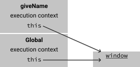
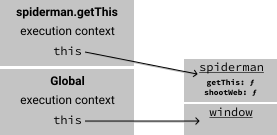
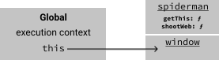

If you're a Java or C# programmer coming to JavaScript, forget all you know about _this_.
In JavaScript, the value of _this_ is unfortunatly not very obvious, since it is determined by _how_ we choose to invoke a function.

There's 4 ways to invoke a function and we'll go over each one:

1. As a function `myFunc()`
2. As a method `myObj.myFunc()`
3. As a constructor `const object = new myFunc()`
4. Via the functions apply or call methods `myFunc.call(myObj)`

So what is this?

_this_ is actually a property of the _execution context_. So to understand what _this_ is, we need to understand what an execution context is.

An execution context is a description of the environment the code is running in.
It has a pointer to the value of _this_ and knows which functions and variables are in scope.

So our JavaScript code is always running in a specific execution context.
Before any code is executed, the JavaScript engine sets up a global execution context for us.

```js
console.log(this)
```

If we run it in a browser, we get something like:

```
Window {parent: global, postMessage: ƒ, blur: ƒ, focus: ƒ, close: ƒ, …}
```

This means that _this_ refers to the window object, but when does it change?
As mentioned we get the value from the execution context, so the value of _this_ of course changes when we enter a new execution context.

We enter a new execution context when we invoke a function. Lets start with a simple example:

### Calling a function _as a function_

```js
function giveName() {
  this.name = "Michael"
}

giveName()
console.log(window.name)
console.log(this.name)
console.log(name)
```

This output is:

```
Michael
Michael
Michael
```

Let's see what's going on in terms of the execution context.
When the code runs, the JavaScript engine has already set up an execution context for us. This is known as the global execution context (GEC).


A new execution context is created when we invoke `giveName`:



Inside `giveName`, we modify _this_ by setting a name property on it. We can see that _this_ references the `window` object.
When we're done executing `giveName`, we **pop** the giveName execution context and return to the global execution context.


It should be no surprise now that all the log statements print Michael.

### Calling a function _as a method_

In object-oriented programming languages you might think of a method as a function that belongs to a class.
In JavaScript however, a method is a function, that belongs to an object.

Let's see an example:

```js
const spiderman = {
  shootWeb: function() {
    console.log("🕸️")
  },
  getThis: function() {
    return this
  },
}

console.log(spiderman === spiderman.getThis())
```

The above program outputs true. The crucial part here is that getThis is a property on spiderman, so invoking it
results in _this_ being set to the object on the left side of the dot, i.e. spiderman.

Here's what's going on in terms of the execution context. The program starts out in the global execution context


When we enter the execution context of the `spiderman.getThis()` call, we see that `this` now points to the
target of the method invocation, namely the spiderman object.



We pop the `spiderman.getThis()` execution context when we return from the function.



The function `getThis` returns the value pointed to by _this_ while it was invoked. In our case _this_ pointed to spiderman and we
therefore see **true** in our output.

### Calling a function _as a constructor_

As you're about to see, there's nothing special about a constructor function.
The only noticeable difference is that it starts with a capital letter, but this is just a convention.
It's a good convention though, so stick to it! What's special is the way we invoke it, using the `new` keyword.

In the next example we use the `new` keyword to invoke the `Superhero` function as a constructor.
This has a few implications:

1. A new object is created
2. The value of _this_ is bound to the new object during execution of the function
3. The object created in step 1 is returned as a result of the whole _new_ expression, unless the function explicitly returns another object.

```js
function Superhero() {
  this.job = "fight crime"
}

const wonderwoman = new Superhero()
console.log(wonderwoman.job)
```

The program outputs: fight crime.


### What if we forget new

### Calling a function _via apply or call_
